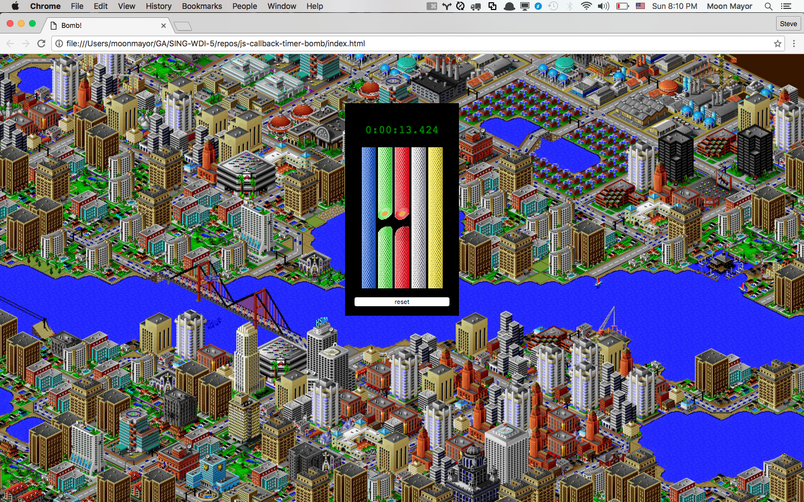

# JavaScript Timers: Sim City Bomb Squad
Someone left a bomb in the middle of Sim City. It's your first day on the
bomb squad and it's your job to defuse it. The entire city is relying on
you!

## The Basics
Create a website that simulates diffusing a bomb. The bomb is made up of a
timer and five wires. The timer counts down from thirty seconds to zero. The
bomb is defused by cutting the correct wires, which are chosen randomly each
time the bomb is set.

Here's a link to a video of the website in action:
<https://youtu.be/zS3HMWLsz6Q>


If the bomb is successfully defused then the timer stops, the text turns green
and Sim City lives on and prospers!



If the timer reaches zero it stops counting down and the image of Sim City is
replaced with an explosion.


## Implementation Details
We're not hanging you out to dry here. Here are some details about how to
build everything.

### Cutting Wires
There are two images for each wire. There's an uncut version and a cut version.
When someone clicks on an uncut wire the image should change to the corresponding
cut version. Once a wire is cut, it should not be possible to uncut it.

You can modify the `src` value of an `img` tag in JavaScript to swap two images
in place in the same img tag.

### Correct vs Incorrect Wires
Each time the bomb is reset it should iterate over the five wires and choose whether
the wire should be cut this round. Choose whether each wire should be cut by using
`Math.random()` and giving each wire a 50/50 chance of it needing to be cut.

Since each wire always has a 50/50 chance of needing to be cut there is some variety
in how many wires need to be cut to defuse the bomb each time. Sometimes all the wires
need to be cut. Sometimes only one wire needs to be cut.

You must decide how your program will keep track of whether each wire should be cut
or not.

The bomb is considered defused when all the wires that need to be cut are cut.

### Blowing Up
The bomb should blow up if someone cuts the wrong wire. When the bomb blows up
the background image should change from showing Sim City to showing the explosion.

After the bomb blows up it should be impossible to cut any more wires. The timer
should stop whenever the bomb blows up. If an incorrect wire was cut then the
time should show how much time was on the clock when the bomb exploded. If the
timer ran all the way to zero then the timer should keep showing zero.

The bomb doesn't blow up immediately. There should be a **750 millisecond
delay** between cutting an incorrect wire and the bomb blowing up. The bomb
should not blow up if the bomb is defused.

It's possible to cut an incorrect wire and then quickly cut all the remaining
correct wires inside the 750 millisecond delay. In this scenario the bomb is
considered defused and it should not explode.

Having a small delay makes people wonder for a moment if they got away with
cutting a wire before the bomb explodes.

### Maintaining State
Try to keep global varaibles to a minimum. Compose the structure of your program
so parameters are passed to functions and return values are used appropriately.

I found it helpful to create variables to keep track of these pieces of
information:
- how long the bomb timer should show at the beginning.
- how long the timer currently has left.
- whether or not the bomb is currently defused.
- whether or not the bomb is currently exploded.
- the number of correct wires already cut
- which wires are the correct wire to cut

## Requirements
- Maintain proper indentation through HTML, CSS and JavaScript files.
- Create CSS classes to encapsulate styling logic. Don't set CSS properties
  and values in JavaScript manually. Only use JavaScript to `add` and remove
  class names from an elements `classList`.
- Use functions to reduce redundancy. For example, our solution code has 40
  lines of CSS, about 170 lines of JavaScript, and about ten functions.
- Demonstrate knowing when to use`setInterval` and `setTimeout` appropriately.
- Use `clearInterval` and `clearTimeout` when timers are no longer needed.
- Use at least one array `forEach` function to iterate through a list.
- Keep the number of global variables to a minimum. The solution code
  uses six global variables.

```js
var list = [1, 2, 3];
list.foreach(function(element) {
  console.log(element);
});
```

### Bonus: Add Sounds
The website will really come alive after adding sound. There's a collection of
original Sim City 2000 sounds included in this repo in the `sounds` directory.

Add the following effects:
- play the electricity sound effect whenever a wire is cut.
- loop the siren while the bomb is being defused.
- play the building explosion effect if the bomb explodes.
- play the cheering noise if the bomb is defused.
- play the success song after the cheering finishes playing.

### Bonus: <audio> Specification
HTML5 added an `<audio>` tag that makes it easy to add sound to a website.

MDN and W3Schools have good documentation about the audio tag. Go to W3Schools
for a basic introduction, and go to MDN if you want to really dig into details
of the specification.

<http://www.w3schools.com/tags/tag_audio.asp>
<https://developer.mozilla.org/en/docs/Web/HTML/Element/audio>

Here's some simple examples of how to interact with audio elements.

```html
<!-- an audio tag with the "controls" attribute will appear on the page. -->
<audio controls src="song.mp3"></audio>

<!--
  An audio tag without "controls" will be invisible.
  Adding the "autoplay" attribute will make the audio start automatically.
  Adding the "loop" attribute will make the audio play forever.
-->
<audio id="background" autoplay loop src="background-music.mp3"></audio>

<audio id="laughter" src="laughter.wav"></audio>
<audio id="cheers" src="cheers.wav"></audio>
<audio id="boo" src="boo.wav"></audio>
```

Select an audio tag as you would any other HTML element.

```js
// trigger audio by calling the play function.
var soundEffect = document.getElementById("laughter");
soundEffect.play();

// "stop" the audio by pausing it and resetting currentTime to zero.
var background = document.getElementById("background");
background.pause();
background.currentTime = 0;
```

You can have one sound play after another by adding an event listener to
an audio element and waiting for it to broadcast it's `"ended"` event:

```js
var first = document.getElementById("laughter");
first.addEventListener("ended", function() {
  var second = document.getElementById("cheers");
  second.play();
});

first.play();
```

Here's some notes from the MDN website explaining these common attributes:

```
autoplay
A Boolean attribute; if specified (even if the value is "false"!), the audio
will automatically begin playback as soon as it can do so, without waiting for
the entire audio file to finish downloading.

controls
If this attribute is present, the browser will offer controls to allow
the user to control audio playback, including volume, seeking, and pause/resume
playback.

loop
A Boolean attribute; if specified, will automatically seek back to the
start upon reaching the end of the audio.
```

## Licensing
All content is licensed under a CC­BY­NC­SA 4.0 license.
All software code is licensed under GNU GPLv3. For commercial use or alternative licensing, please contact legal@ga.co.

